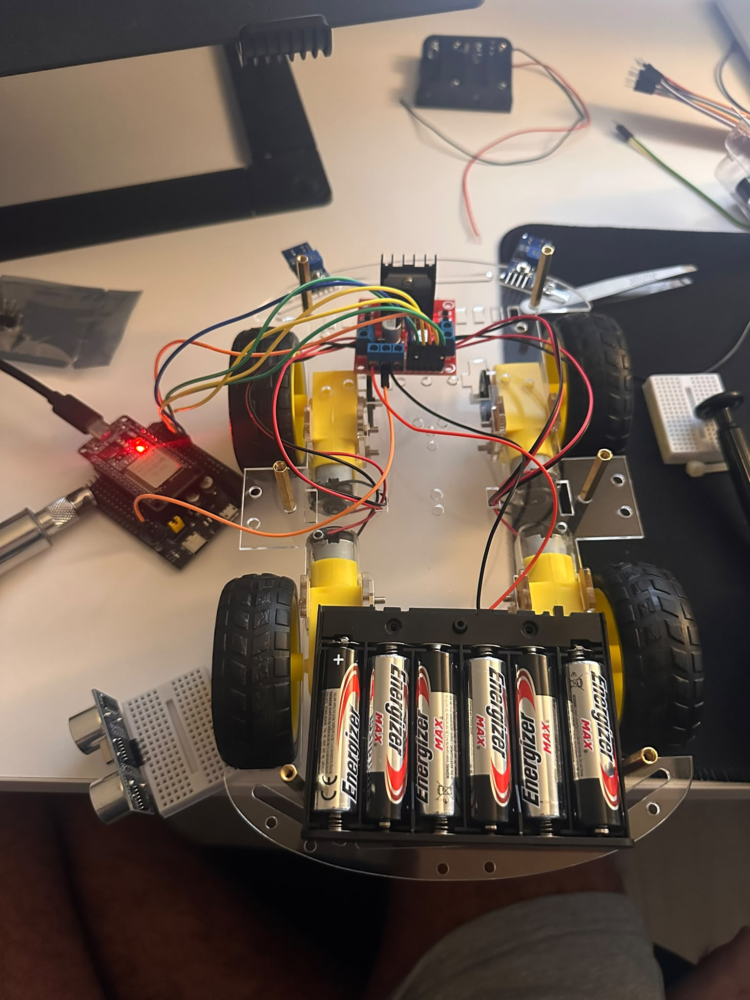

# SafeRover

A small autonomous rover that demonstrates two active automotive safety systems —
**Autonomous Emergency Braking (AEB)** and **Lane Keeping Assist (LKA)** — on an ESP32.

> 🚧 **Status:** In active development. **The rover drives** — the chassis is assembled
> and all four motors run under PWM control in the right direction, on a split supply.
> Both line sensors and the ultrasonic sensor are calibrated and reading, inside one
> non-blocking loop alongside the brake light, status LED and mode button. The OLED is
> the one part still outstanding: its wiring and address were proven with a bus scanner,
> but the module itself has a failed ribbon bond and a replacement is on order.
> See the [roadmap](#roadmap).

SafeRover runs two independent closed control loops (sense → decide → act) on top of a
real-time state machine.

---

## What it does

SafeRover drives on a small track and runs in three modes:

- **Standby** — stopped and ready.
- **Manual** — driven from a phone over Wi-Fi (a dashboard the ESP32 serves).
- **Autonomous** — drives itself, staying inside a marked lane and correcting its own steering.

Two safety layers run on top of *every* mode:

### 🛑 AEB — Autonomous Emergency Braking
A front ultrasonic sensor measures distance continuously and brakes in three escalating
stages, like a real car:

`WARN` (buzzer + brake lights) → `SLOW` (forced deceleration) → `STOP` (full brake)

…with **hysteresis** to prevent jitter at the thresholds.
**This layer overrides every command — it is active even in manual mode.** You cannot drive
the rover into a wall.

### 🛣️ LKA — Lane Keeping Assist
Two infrared sensors detect the lane edges. A **proportional (P) controller** gradually
corrects the steering and slows the rover down in curves.

Around the two safety systems: an on-board **OLED** status display, a **phone dashboard**
with live telemetry and a brake-event log, a physical **mode button**, and every braking
event pushed to the **cloud** (Adafruit IO) with an **NTP** timestamp — building a
remotely-viewable history.

---

## Hardware

| Role | Part |
|------|------|
| Controller | ESP32 DevKit V1 (30-pin) |
| Chassis | CROB2 4WD, 4 motors, no caster |
| Motor driver | L298N + 4× DC motors (4WD, driven as 2 channels) |
| Distance | HC-SR04 ultrasonic |
| Lane sensing | 2× TCRT5000 IR |
| Display | 0.91" I²C OLED — controller not yet identified (SSD1306 or SH110X) |
| Indicators | brake LEDs, buzzer, status LED |
| Input | physical mode button |

**Steering — differential, no servo.** Turning is a *speed difference* between the two
sides: the rover turns toward the slower side. The two motors on each side are wired in
parallel into a single L298N channel — the driver has only two channels, and motors on
the same side always turn the same way at the same speed, so they need no separate
control. 4WD changes the wiring, not the code: `drive(left, right)` is unchanged.

Because the chassis is 4WD with no caster, all four wheels scrub sideways through a
turn. This is expected, and it will make tuning `Kp` in the LKA phase slower.

**Power.** Motors run from a 6×AA pack (~9 V); the ESP32 runs from a separate 5 V power
bank; the two supplies share a common ground. Separating them prevents brownout resets
when the motors spike current. The chassis's own 4×AA holder is not used.

**The display.** Confirmed in phase 2: a 128×32 SSD1306 answering at `0x3C`, found with
the bus scanner in [`tools/i2c_scanner/`](tools/i2c_scanner/) rather than assumed from a
datasheet. The panel renders correctly, but only while the module is squeezed by hand —
the ribbon bonding its driver to the glass has come loose, which is a factory heat-press
joint and not something that can be resoldered. A replacement is on order; the firmware
needs no change.

<details>
<summary><b>Planned pin map (wiring contract)</b></summary>

| Component | Signal | ESP32 pin | Notes |
|-----------|--------|-----------|-------|
| L298N | ENA / IN1 / IN2 | 32 / 33 / 25 | left side, 2 motors in parallel (ENA = PWM) |
| L298N | IN3 / IN4 / ENB | 26 / 27 / 14 | right side, 2 motors in parallel (ENB = PWM) |
| HC-SR04 | TRIG / ECHO | 5 / 18 | ECHO via a 1k/2k voltage divider |
| Line sensor L / R | AO / AO | 34 / 35 | analog, ADC1, input-only pins |
| OLED | SDA / SCL | 21 / 22 | I²C — confirm address with a scanner |
| Buzzer | + | 4 | |
| Brake LEDs | anode | 19 | via 220 Ω each |
| Status LED | anode | 13 | via 220 Ω |
| Mode button | — | 23 | `INPUT_PULLUP` (pressed = LOW) |

Pins avoid the ESP32 boot-strapping pins and ADC2 (disabled when Wi-Fi is on), so the
analog line sensors sit on ADC1. They are also limited to the lines this 30-pin board
actually breaks out — the chip has more GPIO than the headers expose, and GPIO 16/17
are not among them.

**PWM channel allocation.** The ESP32's eight LEDC channels share four timers in pairs
(0-1, 2-3, 4-5, 6-7), and the frequency is a property of the timer rather than the
channel — two channels on one timer cannot run at different frequencies. Channels are
therefore assigned so that nothing shares a timer: **0** for the brake light, **2** for
ENA (left side) and **4** for ENB (right side).

</details>

---

## Architecture

```
[ultrasonic] [2x line sensors] [button] [phone over Wi-Fi]
        \         |          |          /
                 [ ESP32 ]
   AEB safety layer · state machine · LKA · web server
        /         |          \              \
 [L298N + motors] [OLED]  [brake lights+buzzer]  [cloud: NTP + event log]
```

The firmware is split into modules, each built and tested in isolation:

| Module | Responsibility |
|--------|----------------|
| `sensors` | distance (median-filtered), calibrated line reads |
| `motors` | drive / turn / speed (PWM), differential steering, trim |
| `aeb` | WARN / SLOW / STOP stages + hysteresis |
| `lka` | P-controller steering correction |
| `state_machine` | modes + priority (safety overrides everything) |
| `web` + `display` | phone dashboard, commands, OLED |
| `cloud` | NTP time + Adafruit IO events |

**Design rule:** all driving goes through the safety layer — navigation and manual control
call `safeDrive(...)`, never the motors directly, so AEB is impossible to bypass.

---

## Tech stack

- **C++ (Arduino framework)** on the ESP32 — real-time control with a non-blocking
  `millis()` scheduler (no `delay()` in the main loop).
- **[pioarduino](https://github.com/pioarduino/platform-espressif32)** — a community
  PlatformIO fork that tracks the current ESP32 Arduino core.
- Built in **Antigravity** (VS Code-based) with **clangd** IntelliSense.

---

## Build & run

Requires [PlatformIO Core](https://docs.platformio.org/en/latest/core/) (or the pioarduino
IDE extension). From the project root:

```bash
pio run               # compile
pio run -t upload     # flash to the board
pio device monitor    # serial monitor @ 115200 baud
```

The platform, board and library versions are pinned in
[`platformio.ini`](platformio.ini).

There is a second environment holding a one-shot I²C bus scanner, used to prove the
display's wiring and address before any display library is loaded. It is kept out of
`src/` so it never ends up compiled into the rover, and it is built explicitly:

```bash
pio run -e i2c-scanner -t upload
```

---

## Roadmap

| Phase | Milestone | Status |
|:-----:|-----------|:------:|
| 0 | Environment — toolchain + Blink compiles | ✅ |
| 1 | GPIO basics — Serial, button, LED, PWM | ✅ |
| 2 | Sensors on the bench — OLED, ultrasonic, line sensors | 🔄 |
| 3 | Vehicle moves — chassis, power, straight-line trim | ✅ |
| 4 | Phone control — Wi-Fi dashboard + watchdog stop | ⬜ |
| 5 | AEB — 3-stage braking + hysteresis | ⬜ |
| 6 | LKA — track + P-controller tuning | ⬜ |
| 7 | Brain — state machine + non-blocking loop | ⬜ |
| 8 | IoT — live dashboard, NTP, cloud event log | ⬜ |
| 9 | Finish — enclosure, portfolio, dry run | ⬜ |

### Progress photos

[`photos/`](photos/) holds a shot of the build at each stage — the breadboard as it grew,
the serial output captured while the line sensors were being calibrated, and the chassis
coming together.



A build log with the measurements and the faults hit along the way is in
[`docs/journal.md`](docs/journal.md).

_A demo video will follow once the rover drives._

---

## Author

**Ariel Kuznets**
